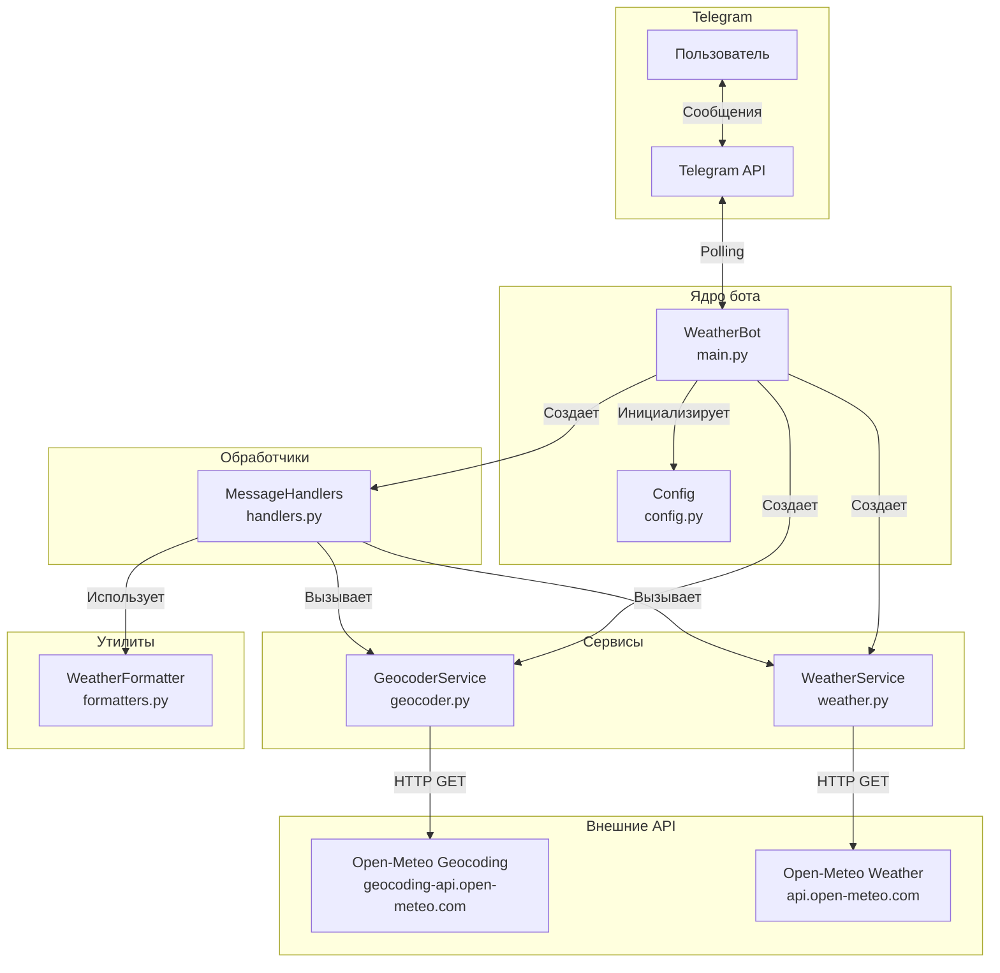

# Телеграм-бот "Прогноз погоды"

Телеграм-бот для курсовой работы

## Архитектура 

- bot.py — управление ботом
- handlers.py — логика ответов
- services/ — бизнес-логика
- main.py — точка входа



## Библиотеки

- aiogram==3.26.0
- httpx==0.28.1

## Запуск проекта

- Клонировать репозиторий
  
```bash
git clone https://github.com/yourusername/weather-bot.git
cd weather-bot
```

- Создать .env файл и разместить следующее
  
```
BOT_TOKEN=ваш токен
```

- Установить зависимости
```bash
pip install -r requirements.txt
```

- Запустить проект

```bash
python main.py
```
